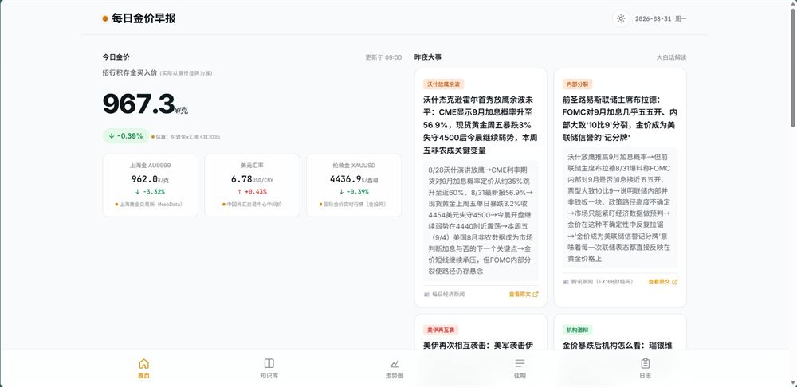
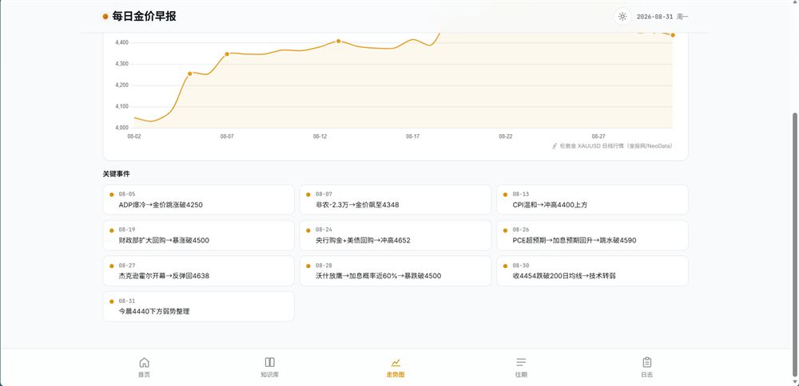
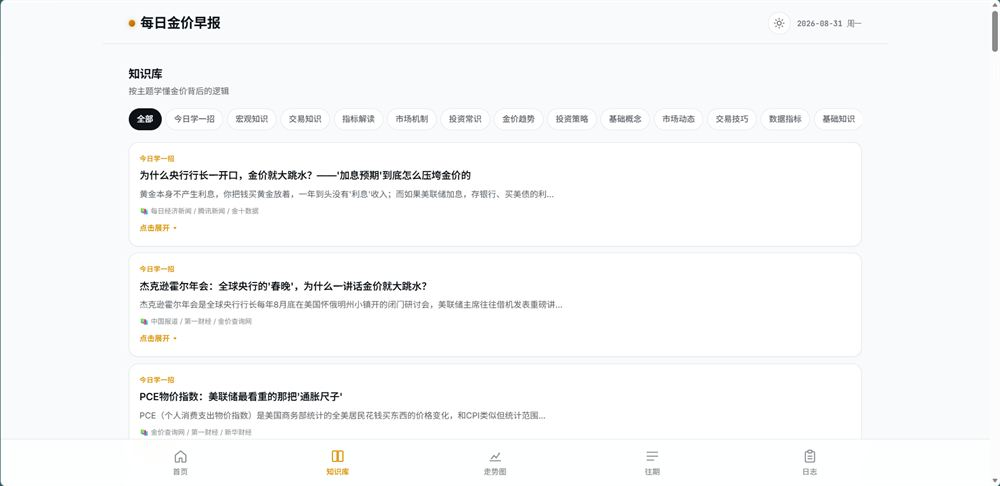
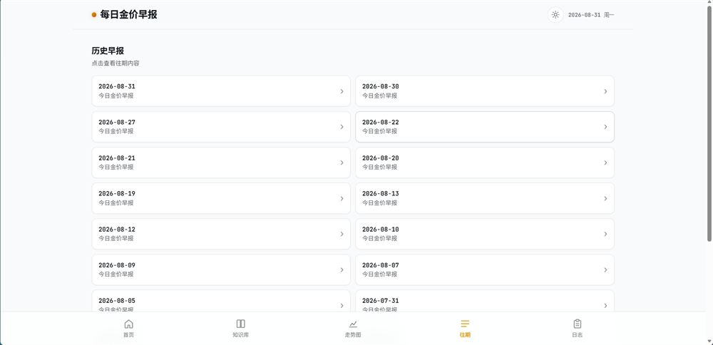
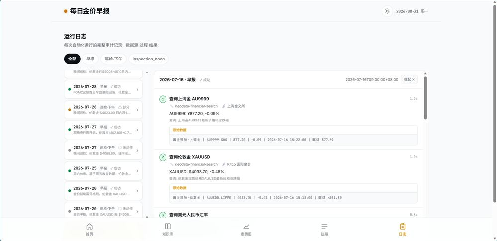

# 每日金价早报

> 大白话读懂金价变动，辅助招行黄金积存金决策的自动化资讯系统。

**每日金价早报**是一套「AI 自动化采集生成 + 静态站点展示」的金价资讯系统：自动化任务每天定时抓取金价 / 汇率 / 重大新闻，AI 用大白话解读并生成结构化早报数据（`daily/*.json`），静态站点负责展示，同时通过邮件推送。

## 页面展示

### 首页：今日金价 + 昨夜大事

主价格（招行积存金买入价估算）+ 上海金 AU9999 / 美元汇率 / 伦敦金 XAU/USD 三列辅助指标，涨跌幅与数据来源全程标注；右侧「昨夜大事」按主题（放鹰 / 内部分裂 / 地缘 / 机构观点）卡片化呈现，附原文链接：



### 走势图：行情 + 关键事件归因

伦敦金 XAU/USD 日线走势（Chart.js 绘制），下方「关键事件」时间线把每个行情拐点与宏观事件一一对应（ADP / 非农 / CPI / 杰克逊霍尔……），一眼看清「为什么涨、为什么跌」：



### 知识库：按主题学懂金价背后的逻辑

金融知识卡片按「宏观知识 / 交易知识 / 指标解读 / 市场机制」等 14 个主题分类，每天用一个真实例子教会一个知识点（如《为什么央行行长一开口，金价就大跳水？》）：



### 往期：历史早报归档

每日早报双列归档，按日期倒序排列，点击回看任意一天的完整早报：



### 日志：自动化运行审计

每次自动化运行（早报 / 午间巡检 / 晚间巡检）的完整审计记录：数据源 → 查询过程 → 结果全链路可追溯，每一步标注工具名、来源机构与耗时，原始数据可展开核验：



## 系统架构

```
自动化任务（每天 09:00 早报 / 14:00、22:00 巡检）
    │
    ├── ① 抓数据：NeoData 金融数据、金投网行情、新闻源（来源与 URL 随数据落盘）
    ├── ② AI 生成：大白话解读 + 趋势判断 + 教学卡片
    ├── ③ 写文件：daily/YYYY-MM-DD.json + logs/*.json（运行审计）
    └── ④ 邮件推送：scripts/send_email.py
    │
    ▼
静态站点（本仓库 index.html）
    ├── 首页 / 走势图 / 知识库 / 往期 / 日志 五个页面
    ├── Chart.js 行情可视化
    └── 明亮 / 暗黑 / 跟随系统三种主题
```

- **内容与样式完全分离**：改样式不影响历史数据，历史早报永久可回看
- **零额外 API 成本**：数据采集与生成由 AI Agent 额度驱动
- **全链路可审计**：`logs/` 下每次运行的采集源、过程、结论全部落盘

## 目录结构

```
├── index.html            # 站点入口（五个页面单文件切换）
├── manifest.json         # 早报索引
├── assets/
│   ├── css/style.css     # 样式（含主题变量）
│   ├── js/app.js         # 页面逻辑（渲染 / 主题切换 / 数据加载）
│   └── screenshots/      # README 截图
├── daily/                # 每日早报数据（YYYY-MM-DD.json）
├── logs/                 # 自动化运行审计日志（早报 / 巡检）
├── scripts/
│   └── send_email.py     # 邮件推送
└── docs/                 # 设计文档
    └── plans/2026-07-16-gold-price-briefing-design.md
```

## 使用

静态站点无需构建，直接用任意静态服务器打开 `index.html` 即可：

```bash
python -m http.server 8080
# 浏览器访问 http://localhost:8080
```

## 设计文档

完整的需求确认、架构设计与数据格式见 [`docs/plans/2026-07-16-gold-price-briefing-design.md`](docs/plans/2026-07-16-gold-price-briefing-design.md)。
